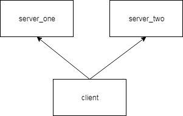
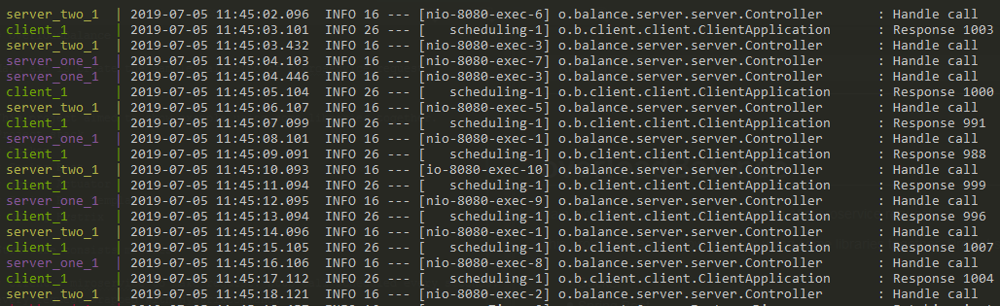

# overloadBalance

Main aim is create the sample balancing of microservice request

This project aimed to show example using some libraries together.

Project stack:
* Docker
* Spring Boot
* Spring Actuator
* Spring Rest Template
* Spring Hystrix

Structure consists modules:

* client - miroservice to make request. Http call scheduled every seconds.
every request wrapped with HystrixCommand.
* cerver - miroservice to handle request. This service can degradate and
reclaim. The longer it collects requests, the bigger the delay of even
request. Break in call stream facilitate decrease delay.
* eureka - discovery service application
* waitFor - tools to make pause until received code 200 from defined
service
* docker - module to build docker images with all thees application

